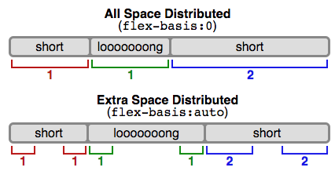

## CSS布局从入门到出门

### display

常见的```display```有下面几种：

* ```block```  块元素，不喜欢和别的元素挨在一起，会从新行开始，还会往左右两边延伸。
  如果给```block```元素设置一个```width```，就可以防止它无止尽的延伸。还可以通过```max-width:600px;margin:0 auto;```让一个```block```的div居中
* ```inline``` 内联元素，最典型的就是```a```和```span ``` ,它们不介意和其它元素挨在一起
* ```none``` script元素的默认```display```就是```none``` ,使用```display:none```时，这个元素不占据空间，就像根本不存在一样。但是如果使用```visibility```，这个元素虽然被隐藏了，但是占的位置还在。
* ```inline-block```，可以有宽高的```inline```元素，而且如果不设置```width```，里面没有内容，就看不见。这种元素可以设置```vertical-align```，一般都设置成```vertical-align:top;```

除此外，```display```还有什么```table```,```list-item```,```flex```,```grid``` …[等等等](https://developer.mozilla.org/en-US/docs/Web/CSS/display)

### 盒模型

我们都知道，一个元素的长宽，是```width/height```和```padding```、```margin```共同决定的。

但是如果给元素设置```box-sizing:border=box```，```padding```和```margin```就不会算在一个盒子的宽度里了。

```css
.simple {
  width: 500px;
  margin: 20px auto;
  -webkit-box-sizing: border-box;
     -moz-box-sizing: border-box;
          box-sizing: border-box;
}
```

### position

为了更负责的布局，就需要```position```，它的值也多到记不住，常见的有：

* ```static``` ， 是默认值，不会带来什么特殊的结果
* ```relative```，如果光写一个```position:relative```，那没什么用。需要加上```top/right/bottom/left```值，这些方位是相对于元素正常的位置来定位的，至于这个元素本来的地盘里空出来的空间，不会有别的元素来占领的。
* ```fixed```，相对于```viewport```定位，就是说即使滚动，这个元素还是在同一个地方。和```relative```一样，```fixed```也需要用```top/right/bottom/left```
* ```absolute```，它相对于最近的、**被定位的**，也就是说**```position```不是```static```**的父元素进行定位，其他方面的表现和```fixed```一样。所以可以想到，```absolute```的元素会跟着滚动条一起滚。
* ```float```，可以用来做图文混排，比如```img{float:right; margin:0 0 1em 1em}``` 。对于```float```来说，比较麻烦的是要在后面清除浮动```.after{clear:both;}``` 
  如果```float```的图片比父元素宽，父元素不会被撑大，所以要给父元素增加一个属性```.clearfix{overflow: auto;}```，如果是IE6，还要```.clearfix {overflow: auto;zoom: 1;}```才能把父元素撑大。

轻松做一个两栏布局：

```css
nav{
  width:200px;
  float:left;
}
section{
  margin-left:200px;
}
```

### 媒体查询

```css
@media screen and (max-width:599px){
  nav li{
    display:inline;
  }
}
```

### column

CSS的新属性，可以用来给```p```分列

```css
.three-column {
  padding: 1em;
  -moz-column-count: 3;
  -moz-column-gap: 1em;
  -webkit-column-count: 3;
  -webkit-column-gap: 1em;
  column-count: 3;
  column-gap: 1em;
}
```

### flexbox


flex-direction:row|row-reverse|column|column-reverse;

flex-wrap:nowrap | wrap |wrap-reverse;

flex-flow:<'flex-direction'> || <'flex-wrap'>;

justify-content: flex-start|flex-end|center|space-between|space-around;

align-items:flex-start|flex-end|baseline|stretch;

align-content:flex-start|flex-end|center|stretch|space-between|space-around;


flex-grow:<number>;

flex-shrink:<number>;

flex-basis:<length>|auto;



flex:none | [<'flex-grow'> <'flex-shrink'>? || <'flex-basis'>]

align-self:auto|flex-start|flex-end|center|baseline|stretch;

Note that `float`, `clear` and `vertical-align` have no effect on a flex item.