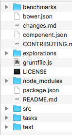

## Grunt..?

> 作为前端小白，真的是赶不上大大们潮流的脚步，经常看到一个项目都是满脸？？？最近在研究Vue的源码，还不是很懂NPM的我居然就开始研究了！！我都为自己捉急！！打开项目目录根本不知道从哪里入手啊。。。所以今天先解决Grunt的问题



虽然不太懂要怎么运行，但我在这些谜样文件中发现一个有点眼熟的文件```gruntfile.js```，似乎。。~~是个管理依赖包的东东~~？


### 什么是grunt

官网说它是 **The  JavaScript Task Runner**

我目前了解到的功能有：

1. 可以压缩CSS、JavaScript


### 怎么装？

1. 首先装上Node，去Node的官网下载对应电脑系统的版本，一路Continue，然后就可以在命令行用```node -v```查看安装的node版本了。
2. 然后在命令行输入```sudo npm install -g grunt-cli```就安装好啦！`grunt-cli`其实也是`Node`模块，它可以帮助我们在控制台中直接运行`grunt`命令。因此当你使用`grunt`的时候，往往都是先安装`grunt-cli`，再安装`grunt`。


### 怎么用？

1. 在项目目录下```npm init```创建```package.json```
2. 然后用```sudo npm install grunt —save-dev```，```—save-dev```的意思是为当前项目安装grunt
3. 然后就可以装插件了，比如压缩CSS的插件```sudo npm install grunt-contrib-cssmin —save-dev```，不要忘记后面的```—save-dev```
4. 新建一个```gruntfile.js``` ,在里面写：

```javascript
module.exports = function(grunt){
	grunt.initConfig({
		pkg:grunt.file.readJSON('package.json'),
		cssmin:{
			options:{
				//针对插件的选项
			},target:{
				files:{
					'output.css':['style.css','reset.css']//把两个css合并并压缩成output.css
				}
			}
		}
	});
	grunt.loadNpmTasks('grunt-contrib-cssmin');//载入插件
	grunt.registerTask('default',['cssmin'])//起名是default的时候，在命令行输入grunt就默认运行
};
```

感觉用起来和gulp好像啊！！

5. 在命令行输入grunt，它会去找```default```并运行。当执行`grunt`命令时，会默认先去全局的`grunt-cli`下找`grunt-cli`模块，而不会先走当前目录下的`node_modules`的`grunt-cli`。
   加载相应的代码后，grunt-cli做了下面的工作：
   - 1 设置控制台的名称
   - 2 获取打开控制台的目录
   - 3 执行`completion`或者`version`或者`help`命令
   - 4 查找grunt，执行相应的命令
   - 5 调用`grunt.cli()`，继续分析参数，执行相应的任务


### 并没有结束！

> 其实很多时候用工具都是这样的，对着官网的例子敲敲敲，解决掉各种各样的报错，就能得到一个正确的输出了，然后就心满意足觉得自己又学到了什么东西一样。。。可能是学会了怎么复制粘贴官网把！学到这里，我知道了grunt可以压缩CSS，可那又咋滴了？对，它还有很多很多的厉害的插件可以用，可是为什么。。为什么。。。为什么呢？它到底是什么？


### Build System

现有的build system 包括```grunt``` ,```gulp```,```brunch``` 

可以用来：

1. 打包合并多个JavaScript文件，减少对服务器的请求，感觉就像Js版的Spirite一样！
2. 给CSS加前缀，不用手动写```-webkit```什么的了
3. uglify Js文件，就是压缩它，让它加载的更快


参考资料：1. http://www.cnblogs.com/xing901022/p/5164257.html

