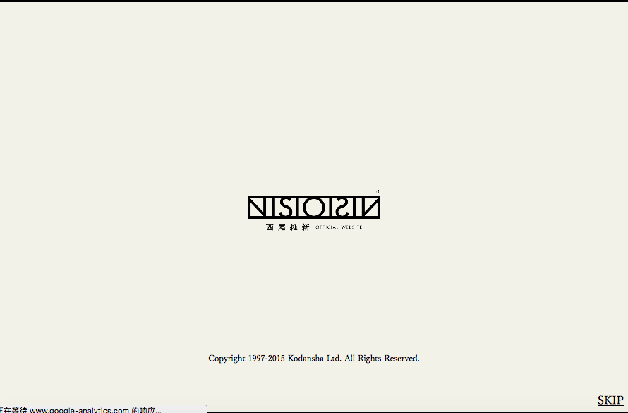
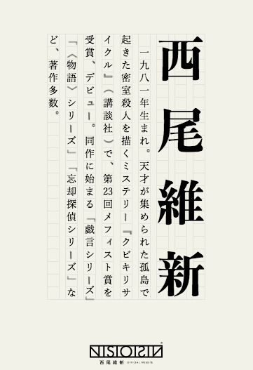
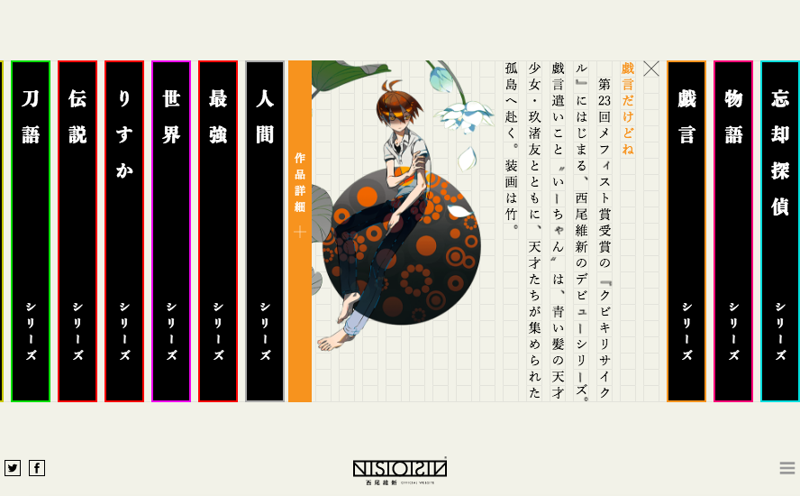

### 漂亮的网站收集

> 有时候看书看到陷入江局的时候，就会觉得好没有干劲啊，觉得很难，学了也不知道有什么用，学会了也不知道能不能找到工作，找到工作了也不知道能不能买房，买房了也不知道小孩能不能有好学校上...
>
> 咳咳，所以需要赶紧想一下自己的初心是什么！来给自己打鸡血啊！
>
> 一方面，我的确很小就开始用电脑了，几乎是同学里最早家里有计算机的，得益于我老妈。。。所以很喜欢用电脑。
>
> 当然也因为是死宅来着，很喜欢看动漫，所以喜欢日本的「和风」文化。
>
> 虽然没有学过画画，但看到自己喜欢也很漂亮的东西的时候，就会忍不住热泪盈眶，这些东西包括「可视化」，嗯，也包括古风的东西。
>
> 我完全就是二等玩家，也没办法引经据典的侃侃而谈，但是每次看到漂亮的可视化、漂亮的和风网站的时候，都好感动啊。
>
> 所以想在这里收集，让我「惊艳到哭泣」的网站／可视化设计，让我在贫乏和单调的日常中，偶尔也能会想起的初心吧。

### [西尾维新的官方网站](http://ni.siois.in/)

